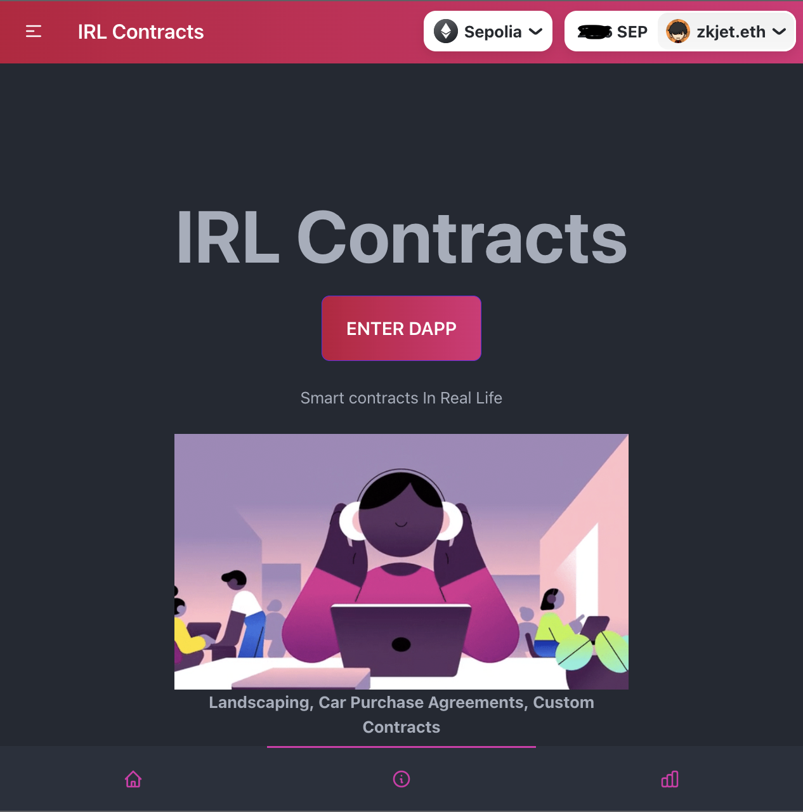

<br />
<br />
<p align="center">
  <a href="https://www.www.com">
    
  </a>
</p>

<!-- DOCUMENTATION -->


## Documentation

Presentation [is available here](https://www.www.com).

Information [](https://github.com/zkjet).

## Getting Started

[Get your project up and running in just a couple of minutes](https://easybase.io/react/#setup):

IRL Contracts is a Decentralized application utilizing smart contracts to integrate and automate real life contractable transactions such as private auto sales, landscaping contracts, and second hand collectibles.

```shell
├── src/
│   ├── App.js
│   ├── index.js
├── assets/
├── package.json
└── ...
```

2. Step 2
```
npm install 
```

```jsx
import React, { useEffect } from "react";

function App() {
  return (
    <App />
  );
}
```

## Examples

* []()

* []()

* []()

<!-- CONTACT -->
## Contact

[@zkjet](https://twitter.com/zkjet) – zkjet@mailfence.com